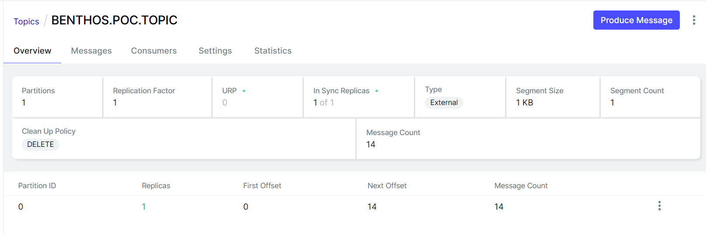

# Simple SQL to Kafka data stream

This is the first scenario thought.

Initially we implemented a quite simple structure, via docker, in which we raise a populated POSTGRES instance and
through RedPanda migrate this data to a Kafka Topic.

We've imagined this scenario supposing this data could be consumed by an application and processed in a certain way.
The table could be registering an event without the necessity to be immediately consumed, for example, or a data sink
storing information that could or not be reprocessed.

## How to run it

At the current folder raise docker structure with `docker-compose up` command.

Once containers are running healthy run, with redPanda connect CLI the respective script

```
 rpk connect run scripts/stream.yml
```

in Kafka-ui interface or another kafka auxiliary tool we should see data being populated in correspondent topic

